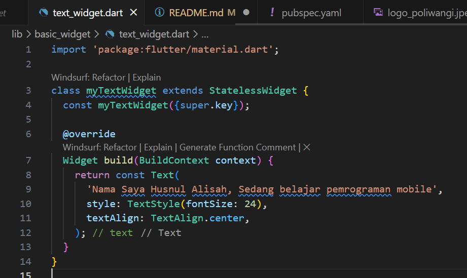

# PRAKTIKUM PROJECT FLUTTER

Pertama di vscode bisa di liat pojok kiri bawah seting bergerigi lalu klik, kemudian pilih atas sendiri yang command palette untuk menampilkan pembuatan proyek klik di atas flutter.Ketik">flutter: New Project

Kemudian beri nama "hello word" lokasi folder proyek untuk tempat proyek flutter dibuat

Lalu masukan lagi nama proyek yang sudah dibuat tadi untuk proyek baru

# MEMBUAT REPOSITORY GITHUB

Kemudian buka GitHub untuk membuat repository lalu klik profile dan pilih Your repositories klik New di kanan pojok atas lalu di isi nama "flutter-fundamental-part1"

Lalu akan menampilkan printah" yang digunakan untuk input data yang ada di vscode ke dalam repository GitHub

Terminal vscode yang ada di proyek hello_word ketikan printah git init

Kemudian masuk ke Source control pada Source control pilih file .gitignore lalu tekan tombol +

Tambahkan "tambah gitignore" kemudian commit

klik titik tiga lalu push

Lalu ada notifikasi di pojok kanan bawah kemudian di klik Add Remote

 ketik "orogin" sebagai nama remote dan opsi untuk menambahkan ke GitHub
 

kemudian Output terminal yang menampilkan git push -u origin main yang berhasil,menampilkan progress upload dan konfirmasi push ke repository GitHub
 

Tampilan akhir di halaman repository GitHub
 

#MENERAPKAN WIDGET

Buat file baru di dalam lib dengan dan text_widget dan image_widget
 

Kode text_widget
 

kode main dan hasil dari text_widget
 

kemudian untuk image_widget, buat folder terlebih dahulu diluar lib dengan nama assets lalu masukan foto yang akan ditampilkan
 

lihat di file pubspec.yml mengaktifkan assets masukan folder dan file fotonya
 

kode file image_widget
 

hasil dari image_widget
 

